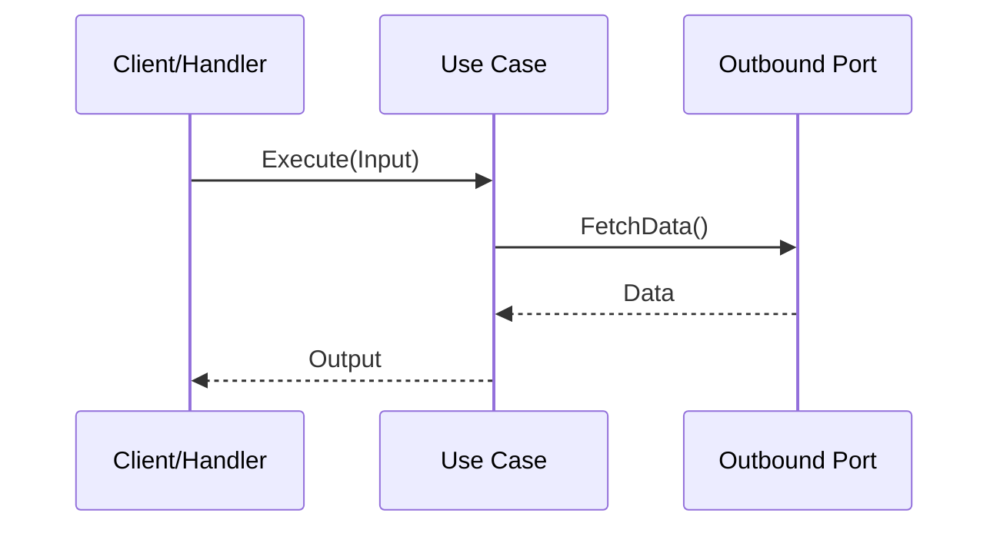

# Use Case Specification: [Use Case Name]

## 1. Metadata
- **Use Case ID**: UC-{DOMAIN}-{SEQUENCE}
- **Status**: Draft | Active | Completed
- **Created Date**: YYYY-MM-DD

## 2. Business Goal
[Goal of the use case and the business value it delivers]

## 3. Inbound Port
[The Hexagonal Architecture Inbound Port / Interface definition]

## 4. Inputs
[Input parameters or DTOs mapped from Hexagonal Inbound Ports]

## 5. Outputs
[Return values, DTOs, or Exceptions/Errors thrown]

## 6. Business Rules
- **BR-001**: [Domain rules enforced explicitly by this use case]

## 7. Workflow
1. [Step 1: Validate input]
2. [Step 2: Invoke Outbound Port]
3. [Step 3: Map to Output DTO]

## 8. Outbound Dependencies
[Hexagonal Architecture Outbound Ports (Repositories, External Services, Event Buses) required by this Use Case]

## 9. Sequence Diagram

## 10. BDD Scenarios
**Scenario**: [Use case execution]
Given [Input state]
When [Use case is executed]
Then [Output state]

## 11. Acceptance Criteria
- [ ] AC-001: [Criterion]

## Related

### Requirements

* REQ-{DOMAIN}-{SEQUENCE}

### Features

* FEATURE-{DOMAIN}-{SEQUENCE}

### Scenarios

* SCN-{DOMAIN}-{SEQUENCE}

### Tasks

* TASK-{DOMAIN}-{FEATURE-SEQUENCE}-{TASK-SEQUENCE}

### Use Cases

* UC-{DOMAIN}-{SEQUENCE}

### Repositories

* REPO-{DOMAIN}-{SEQUENCE}

### APIs

* API-{DOMAIN}-{SEQUENCE}

### Tests

* TEST-{DOMAIN}-{SEQUENCE}

### ADRs

* ADR-{SEQUENCE}

### Releases

* REL-{MAJOR.MINOR.PATCH}
